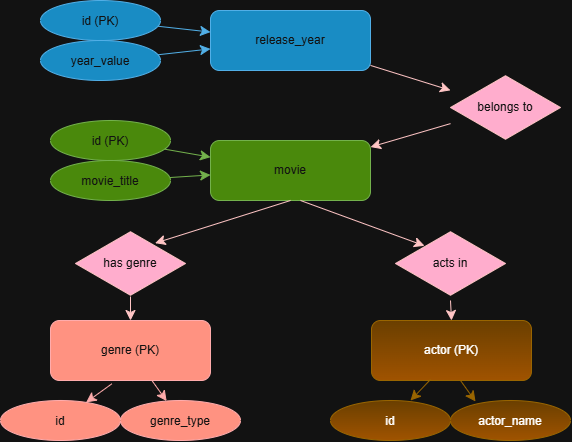
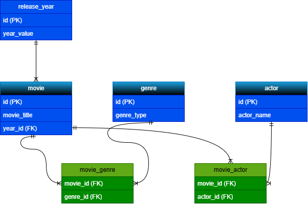
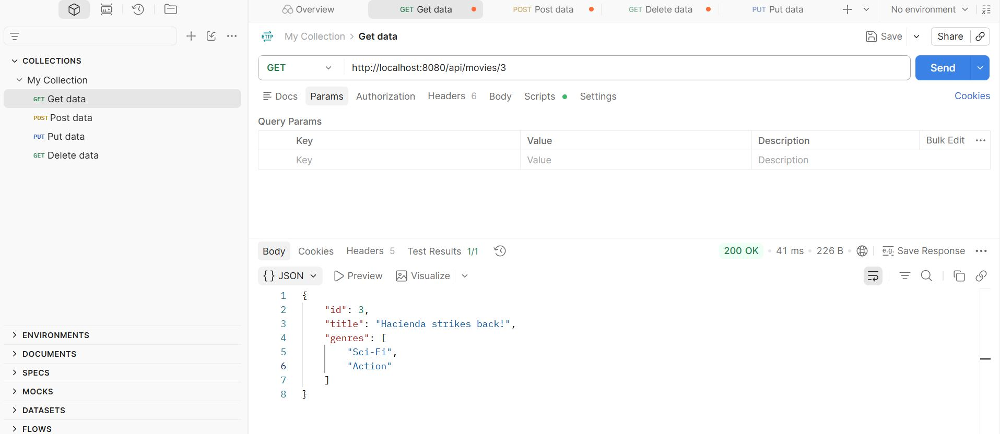
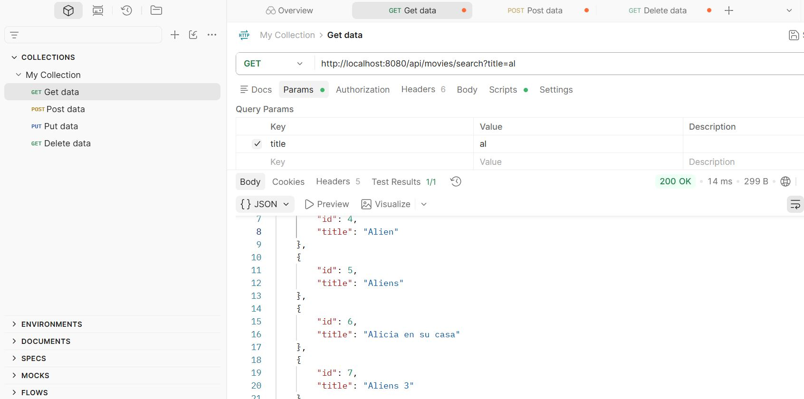
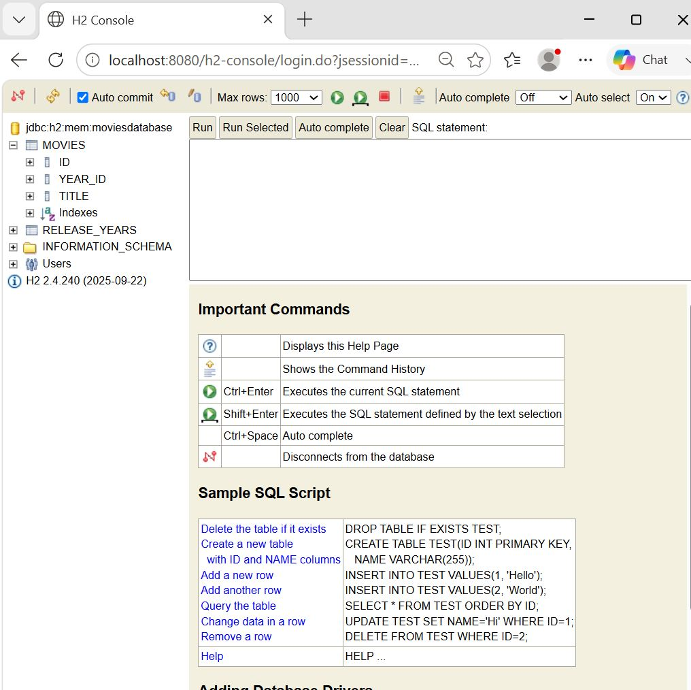

# Movies API

Proyecto de creación de API REST para la gestión de una colección de películas con relaciones a géneros, año de estreno y actores. Desarrollada con **Java 21** y **Spring Boot**, siguiendo una arquitectura por capas y principios SOLID.

---

## Tabla de contenidos

- [Características](#características)
- [Stack tecnológico](#stack-tecnológico)
- [Arquitectura](#arquitectura)
- [Modelo de datos](#modelo-de-datos)
- [Instalación y ejecución](#instalación-y-ejecución)
- [Endpoints](#endpoints)
- [Ejemplos de uso](#ejemplos-de-uso)
- [Base de datos](#base-de-datos)

---

## Características

- CRUD completo de películas (crear, listar, obtener por id, actualizar, eliminar).
- Gestión de géneros y asociación de géneros a películas (relación N:M).
- Búsqueda de películas por título y por género (parcial, sin distinguir mayúsculas).
- Uso de **DTOs** (Request/Response) para desacoplar la API de las entidades internas.
- **Validación** de datos de entrada con respuestas de error claras.
- **Manejo centralizado de excepciones** con códigos HTTP adecuados (404, 400).

---

## Stack tecnológico

| Tecnología | Uso |
|------------|-----|
| Java 21 | Lenguaje |
| Spring Boot | Framework principal |
| Spring Web | Capa REST |
| Spring Data JPA | Persistencia |
| Hibernate Validator | Validación de DTOs |
| H2 | Base de datos en memoria (desarrollo) |
| Maven | Gestión de dependencias y build |

---

## Arquitectura

El proyecto sigue una **estructura por features** (una carpeta por entidad), con separación en capas dentro de cada una:

```
dev.juanim.movies_api
├── actor/
│   ├── Actor.java
│   └── ActorRepository.java
├── genre/
│   ├── Genre.java
│   ├── GenreController.java
│   ├── GenreRepository.java
│   └── GenreServiceImpl.java
├── global/
│   └── GlobalExceptionHandler.java        → manejador global de excepciones
├── implementations/                        → interfaces genéricas de servicio
│   ├── InterfaceGenericGetService.java     → contrato de lectura
│   └── InterfaceGenericWriteService.java   → contrato de escritura
├── movie/
│   ├── dtos/
│   │   ├── MovieRequestDTO.java            → datos de entrada (con validación)
│   │   └── MovieResponseDTO.java           → datos de salida
│   ├── exceptions/
│   │   └── MovieNotFoundException.java     → excepción específica de película
│   ├── implementations/
│   │   └── InterfaceMovieSearchService.java → contrato de búsqueda (título/género)
│   ├── mappers/
│   │   └── MovieMapper.java                → conversión entidad ↔ DTO
│   ├── Movie.java
│   ├── MovieController.java
│   ├── MovieRepository.java
│   └── MovieServiceImpl.java
├── releaseyear/
│   └── ReleaseYear.java
└── MoviesApiApplication.java               → clase principal
```
Se observará que releaseyear no tiene repositorio ni servicio. Ésta decisión responde a que únicamente se gestiona a través de movie (FK year_id en el diagrama).

**Principios aplicados:**

- **Interfaces genéricas segregadas** (`InterfaceGenericGetService`, `InterfaceGenericWriteService`): separan lectura y escritura, y son reutilizables por cualquier entidad.
- **Inversión de dependencias**: los controladores dependen de interfaces, no de implementaciones concretas.
- **DTOs y mapper**: la entidad nunca se expone directamente por la red.

---

## Modelo de datos

### Diagrama entidad-relación (modelo Chen)



### Diagrama relacional (patas de gallo)



**Relaciones:**

- **Movie → ReleaseYear** (N:1): cada película tiene un año de estreno.
- **Movie ↔ Genre** (N:M): una película tiene varios géneros y un género pertenece a varias películas (tabla puente `movie_genre`).
- **Movie ↔ Actor** (N:M): tabla puente `movie_actor`.

---

## Instalación y ejecución

### Requisitos previos

- Java 21 o superior
- Maven 3.9+

### Pasos

1. Clonar el repositorio:

   ```bash
   git clone https://github.com/JuanIsidroMenendez/movies-api.git
   cd movies-api
   ```

2. Compilar el proyecto:

   ```bash
   mvn clean compile
   ```

3. Arrancar la aplicación:

   ```bash
   mvn spring-boot:run
   ```

4. La API estará disponible en `http://localhost:8080`.

La consola de H2 (base de datos en memoria) está accesible en `http://localhost:8080/h2-console`.

---

## Endpoints

### Películas — `/api/movies`

| Método | Ruta | Descripción |
|--------|------|-------------|
| `GET` | `/api/movies` | Lista todas las películas |
| `GET` | `/api/movies/{id}` | Obtiene una película por su id |
| `POST` | `/api/movies` | Crea una película |
| `PUT` | `/api/movies/{id}` | Actualiza una película |
| `DELETE` | `/api/movies/{id}` | Elimina una película |
| `GET` | `/api/movies/search?title={texto}` | Busca películas por título (parcial) |
| `GET` | `/api/movies/search/genre?genre={texto}` | Busca películas por género (parcial) |

### Géneros — `/api/genres`

| Método | Ruta | Descripción |
|--------|------|-------------|
| `GET` | `/api/genres` | Lista todos los géneros |
| `POST` | `/api/genres` | Crea un género |

---

## Ejemplos de uso

### Crear un género

```http
POST /api/genres
Content-Type: application/json

{
    "name": "Sci-Fi"
}
```

### Crear una película con géneros

Se envían los **ids** de géneros existentes; la respuesta devuelve los **nombres**.

```http
POST /api/movies
Content-Type: application/json

{
    "title": "Alien",
    "genreIds": [1, 2]
}
```

Respuesta:

```json
{
    "id": 1,
    "title": "Alien",
    "genres": ["Sci-Fi", "Action"]
}
```

### Obtener una película por id



### Buscar películas por título

La búsqueda es parcial e ignora mayúsculas: `?title=al` devuelve todas las que contienen «al».



### Manejo de errores

Al solicitar una película inexistente, la API responde con un `404` y un cuerpo JSON descriptivo:

```json
{
    "timestamp": "2026-08-28T09:00:00",
    "status": 404,
    "error": "Not Found",
    "message": "Movie with id 999 not found"
}
```

Si se envía una película sin título, la validación responde con `400 Bad Request`.

---

## Base de datos

Durante el desarrollo se utiliza **H2 en memoria**, que recrea el esquema en cada arranque. La siguiente captura muestra las tablas generadas por JPA a partir de las entidades, incluida la clave foránea `YEAR_ID` de la relación con el año de estreno que mencionamos anteriormente, a efectos de explicar el por qué release no presenta controlador ni servicio:



---

## Autor

Juan Isidro Menéndez.